# Arc Reference Cycle Analysis for kairosdb-ingest

## Arc Usage Overview

Based on analysis of the codebase, here's a directed graph of Arc relationships and potential cycles:

```mermaid
graph TD
    %% Main Service Components
    IS[IngestionService] --> |Arc IngestConfig| IC[IngestConfig]
    IS --> |Arc PersistentQueue| PQ[PersistentQueue]
    IS --> |Arc IngestionMetrics| IM[IngestionMetrics]
    IS --> |Arc AtomicU64| BP[backpressure_active]
    
    %% Cassandra Client Relationships
    IS --> |BoxedCassandraClient Arc| CC[CassandraClient]
    CC --> |Arc Session| CS[CassandraSession]
    CC --> |Arc CassandraConfig| CCFG[CassandraConfig]
    CC --> |Arc MultiWorkerStats| MWS[MultiWorkerStats]
    CC --> |Arc BloomManager| BM[BloomManager]
    
    %% Metrics Internal Structure - POTENTIAL CYCLE AREA
    IM --> |Arc AtomicU64| DP[datapoints_ingested]
    IM --> |Arc AtomicU64| BP2[batches_processed]
    IM --> |Arc AtomicU64| IE[ingestion_errors]
    IM --> |Arc AtomicU64| VE[validation_errors]
    IM --> |Arc AtomicU64| CE[cassandra_errors]
    IM --> |Arc AtomicU64| MU[memory_usage]
    IM --> |Arc AtomicU64| ABT[avg_batch_time_ms]
    IM --> |Arc RwLock| LBT[last_batch_time]
    IM --> |Arc AtomicU64| WCU[work_channel_utilization]
    IM --> |Arc AtomicU64| RCU[response_channel_utilization]
    IM --> |Arc AtomicU64| WCAU[work_channel_avg_utilization]
    IM --> |Arc AtomicU64| RCAU[response_channel_avg_utilization]
    IM --> |Arc AtomicU64| BMU[bloom_memory_usage]
    
    %% Background Task References - CYCLE RISK
    BT1[metrics_update_task] --> |Arc CassandraClient| CC
    BT1 --> |Arc AtomicU64| BMU
    BT1 --> |Arc ShutdownManager| SM[ShutdownManager]
    
    BT2[queue_processor_task] --> |Arc PersistentQueue| PQ
    BT2 --> |Arc CassandraClient| CC
    BT2 --> |Arc IngestConfig| IC
    BT2 --> |IngestionMetrics clone| IM
    BT2 --> |Arc ShutdownManager| SM
    
    %% Shutdown Manager Relationships
    SM --> |Arc RwLock| SP[current_phase]
    SM --> |Arc Notify| PN[phase_notify]
    SM --> |Arc AtomicU64| AC[active_connections]
    
    %% Persistent Queue Internal - POTENTIAL ISSUE
    PQ --> |Arc Keyspace| KS[Keyspace]
    
    %% Bloom Manager Internal
    BM --> |Arc RwLock| BS[BloomState]
    
    %% CRITICAL: Task Spawn Cycles
    IS -.->|spawns with self refs| BT1
    IS -.->|spawns with self refs| BT2
    BT1 -.->|holds refs back to| IS
    BT2 -.->|holds refs back to| IS
    
    %% Style for potential cycle areas
    classDef cycleRisk fill:#ffcccc,stroke:#ff0000,stroke-width:2px
    classDef highMemory fill:#ffffcc,stroke:#ffaa00,stroke-width:2px
    
    class BT1,BT2,IM cycleRisk
    class PQ,BM,CC highMemory
```



## Identified Potential Cycles

### 🟡 **Stable Background Task References** *(Lower Risk)*

**Location**: `kairosdb-ingest/src/ingestion.rs:287-333` and `kairosdb-ingest/src/ingestion.rs:456-486`

**Analysis Update**: Since these background tasks are started once at service initialization and remain stable throughout the application lifetime, **the cycle risk is much lower**. The Arc references they hold are essentially static allocations that persist for the application's duration.

**What happens**:
1. `IngestionService` spawns 2 background tasks once (`metrics_update_task` and `queue_processor_task`)
2. These tasks hold stable `Arc` references to service components
3. Tasks run continuously but don't create/destroy additional references
4. Memory usage from these references should be **constant**, not growing

### 🔴 **High Memory Growth Pattern**

**Multiple Arc<AtomicU64> per IngestionMetrics instance**:
```rust
// From ingestion.rs:174-188 - Creates 12+ Arc<AtomicU64> per service instance
datapoints_ingested: Arc<AtomicU64>,
batches_processed: Arc<AtomicU64>, 
ingestion_errors: Arc<AtomicU64>,
validation_errors: Arc<AtomicU64>,
cassandra_errors: Arc<AtomicU64>,
memory_usage: Arc<AtomicU64>,
avg_batch_time_ms: Arc<AtomicU64>,
work_channel_utilization: Arc<AtomicU64>,
response_channel_utilization: Arc<AtomicU64>,
work_channel_avg_utilization: Arc<AtomicU64>,
response_channel_avg_utilization: Arc<AtomicU64>,
bloom_memory_usage: Arc<AtomicU64>,
```

### 🟡 **Potential Weak Cycles**

1. **CassandraClient → BloomManager → internal state**
   - `Arc<BloomManager>` shared across workers
   - `Arc<RwLock<BloomState>>` internal state

2. **PersistentQueue → Fjall Keyspace**
   - `Arc<Keyspace>` for LSM storage

## Memory Growth Analysis

**Revised analysis based on stable background tasks**:

**Most likely suspects for memory growth during queue processing**:

1. **🔴 MPMC channel message accumulation**
   - `WorkItem` and `WorkResponse` structs contain `DataPointBatch` clones
   - If Cassandra workers fall behind, messages accumulate in `flume` channels
   - Each `DataPointBatch` can contain many data points with full metric names/tags
   - **This is the most likely cause** of memory growth during queue processing

2. **🟡 Queue entry accumulation in PersistentQueue**
   - `QueueEntry` contains full `DataPointBatch` data
   - If processing falls behind ingestion, queue grows on disk AND in memory
   - Memory usage from active queue scanning and batching operations

3. **🟡 BloomManager memory growth**
   - Shared `Arc<BloomManager>` across all Cassandra workers
   - Bloom filters grow over time as new metrics are seen
   - Secondary bloom filter rotations may not be releasing memory properly

## Recommendations

### 🎯 **Immediate Actions** *(Focus on External Dependencies)*

1. **🔍 Profile with system-level memory tools**:
   ```bash
   # Use heaptrack to see actual allocations (not just Rust heap)
   heaptrack /path/to/kairosdb-ingest
   
   # Or use perf/valgrind to track memory growth
   valgrind --tool=massif --time-unit=ms ./kairosdb-ingest
   ```

2. **🔍 Investigate ScyllaDB driver behavior**:
   - Check ScyllaDB driver version and known memory issues
   - Look for driver configuration options to limit caches
   - Monitor connection pool size and prepared statement counts
   - **Key**: The 796MB is likely here since no Cassandra metrics are exposed

3. **🔍 Investigate Fjall LSM memory behavior**:
   ```bash
   # Check Fjall data directory size vs memory usage
   du -sh ./data/queue/
   
   # Look for LSM configuration options to limit memory usage
   # Check Fjall version for known memory leaks
   ```

### 🔍 **Investigation Steps**

1. **Profile memory at system level** (not Rust application level):
   ```bash
   # Track actual memory allocations
   sudo perf record -g ./kairosdb-ingest
   sudo perf report
   ```

2. **Test dependency isolation**:
   - Try running with mock Cassandra client to isolate ScyllaDB driver
   - Try disabling persistent queue to isolate Fjall LSM engine
   - Compare memory usage between configurations

3. **Check dependency versions for known issues**:
   ```bash
   cargo tree | grep -E "(scylla|fjall)"
   ```

## 🎯 **Conclusion**

**The Arc cycles in your Rust code are NOT the problem.** The memory leak is in external dependencies (ScyllaDB driver or Fjall LSM) that consume ~796MB but don't expose metrics to your application. Focus investigation on system-level memory profiling rather than Rust Arc analysis.

**CRITICAL UPDATE**: Analysis of actual metrics reveals the issue is **NOT in application Arc cycles**.

## 📊 **Actual Memory Usage Analysis**

**Real memory consumption**:
- **Kubernetes pod memory**: `799MB` (kubectl top)
- **Application tracked bloom memory**: `2.4MB` 
- **Application tracked general memory**: `0MB` (not working)
- **Queue state**: Completely drained (0 batches pending)
- **Channel utilization**: Low (33% work, 0% response)

**Gap**: **~796MB of untracked memory usage** - this is NOT in your Rust application code!

## 🔴 **Real Memory Leak Suspects** *(External Dependencies)*

**Most likely culprits for the 796MB untracked memory**:

1. **🔴 ScyllaDB Rust Driver Internal State**:
   - Connection pool memory growth over time
   - Prepared statement metadata cache accumulation  
   - Token metadata, schema cache, or query plan cache growth
   - Driver-internal buffers that don't get released
   - **Evidence**: No Cassandra metrics exposed, completely opaque to application

2. **🔴 Fjall LSM Engine Internal Caches**:
   - Block cache, page cache, or buffer pools that grow during processing
   - SSTable metadata that accumulates over time
   - LSM compaction state or WAL segments not being freed
   - **Evidence**: Only `Arc<Keyspace>` visible to application, internals hidden

3. **🟡 Tokio Runtime/System Allocations**:
   - Thread pool memory, async task memory pools
   - Memory fragmentation from high-frequency allocations
   - **Evidence**: 200 Cassandra worker tasks + background processing